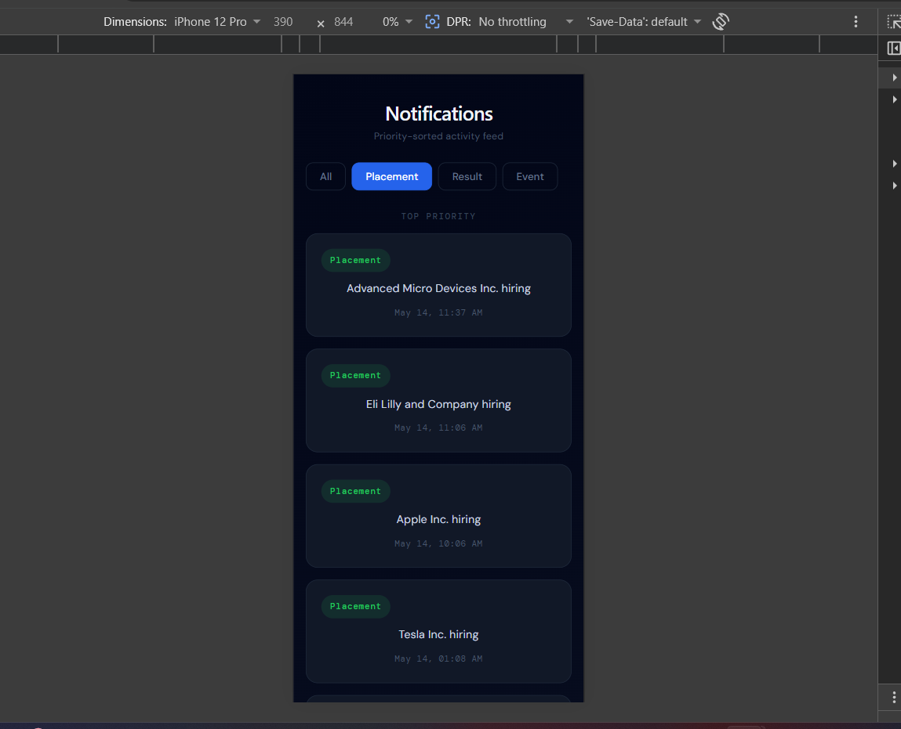
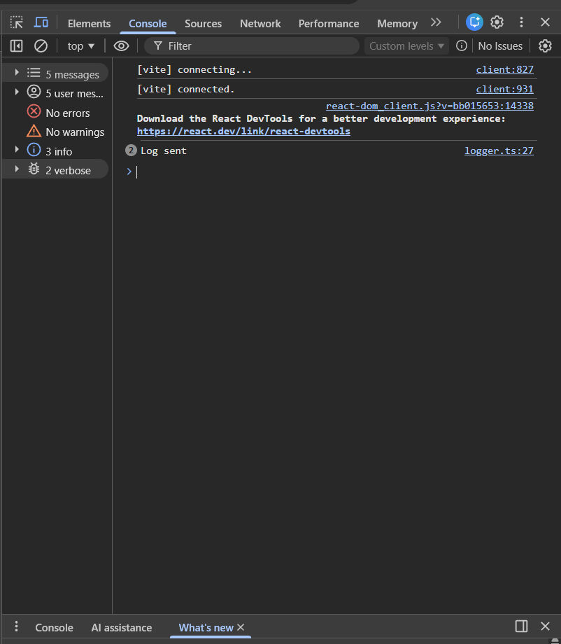

# Smart Notification Dashboard

A scalable full stack notification management system built using React, TypeScript, and a centralized logging middleware.

---

# Features

- Real-time notification dashboard
- Priority-based notification sorting
- Filtering by notification type
- Responsive desktop and mobile UI
- Centralized logging middleware
- Secure API integration
- Stage-wise system design documentation

---

# Tech Stack

## Frontend
- React
- TypeScript
- Vite
- Axios

## Logging Middleware
- TypeScript
- Axios

---

# Folder Structure

```bash
12301143/
│
├── logging_middleware/
├── notification_app_be/
├── notification_app_fe/
├── notification_system_design.md
└── .gitignore
```

---

# Screenshots

## Desktop View


---

## Mobile View



---

## Logging Console



---

# Demo Video

Download and watch the demo video here:

[Demo Video](./notification_app_fe/demo.mp4)

---

# Features Implemented

- Notification fetching from API
- Priority inbox logic
- Notification filtering
- Responsive UI
- Logging integration
- Error handling
- API abstraction layer

---

# Priority Logic

```ts
Placement > Result > Event
```

Notifications are sorted using:
1. Priority
2. Latest timestamp

---

# Logging Middleware

Reusable logging utility implemented using:

```ts
Log(stack, level, package, message)
```

Used throughout:
- API calls
- Errors
- Component lifecycle events

---

# Run Locally

## Frontend

```bash
cd notification_app_fe
npm install
npm run dev
```

---

# Author

Lakshit Raina
Roll Number: 12301143
